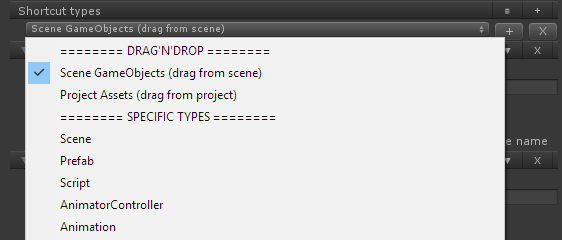
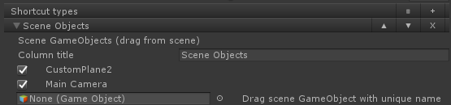
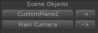
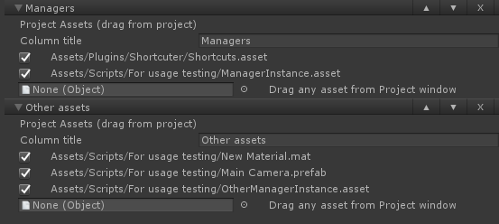
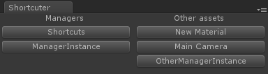
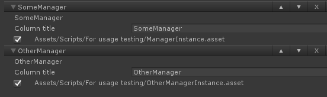
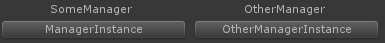
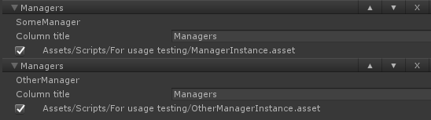
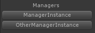

# 

**Simple shortcut utility for Unity**

 
 
## Contents

1. <a href="#introduction">Introduction</a>
2. <a href="#features">Features</a>
3. <a href="#new-features">New Features</a>
3. <a href="#quick-start">Quick start</a>
3. <a href="#notes">Notes</a>
3. <a href="#changelog">Changelog</a>
4. <a href="#support">Support</a>
5. <a href="#license">License</a>

## Introduction

*Shortcuter* is an easy to use simple shortcut utility for Unity.

It features a dockable window which can be configured with shortcuts to most frequently used scenes and project objects.

Compatible with Unity 5 and 4.

## Features

* Quick access to your most used scenes and objects from a dockable window.
* Easy to use toggle based interface to select shortcuts.
* Configure shortcuts for most common Unity objects (Scenes, Scripts, Prefabs and more).
* Create shortcuts for custom objects.
* Persistent shortcuts data.

## New Features
These are some new extensions, increasing original Shortcuter functionality:

* Support for scene GameObject references (drag'n'drop)
* Possibility to move scene view into GameObject reference (instead of selecting it)
* Support for creating custom asset lists, with assets of various types, added with drag'n'drop
* Possibility to merge different columns of assets into just one displayed when you use the same column name (for example for many ScriptableObject managers with just one instance)

## Quick start

1\. Open *Shortcuter* by going to `Window/Shortcuter` or by using the keyboard shortcut (`CTRL + ALT + S` on Windows and `CMD + OPTION + S` on Mac).

2\. When opening the *Shortcuter* window for the first time, no shortcuts are available. Click on `Edit shortcuts` to bring the shortcuts editor.

**Hint:**  at any moment, you can also open the shortcuts editor by accessing the *Shortcuter* window context menu.

3\. From the shortcuts editor, you can add as many shortcuts lists as you want. You can choose scene GameObject references, any assets from project lists, or a specific type.

4\. To add a reference, just drag and drop it. To remove, just deselect reference.

 **IMPORTANT:** scene GameObject reference are recognised just by name, so if you want to have a working shortcut it has to has an unique name.

5\. Scene GameObjects references are now appearing on the *Shortcuter* window, clicking on it's name will select it, clicking on the arrow next to it will center *Scene view* on this GameObject.

6\. If you choose *Project Assets*, you can drag and drop any assets from the *Project* window. 

Then they will be available on the *Shortcuter* window.

7\. From the shortcuts editor, you can add as many shortcuts as you want based on types available on your project and also configure the quantity and title of the columns displayed on the *Shortcuter* window.

8\. After selecting your most frequently used shortcuts, they'll be available on the *Shortcuter* window!

9\. There is also a possibility to merge different types of assets into one displayed list.

 

Just use same column name for assets list that you want to appear as one list, then they will be automatically merged while displaying. However, they are still staying as different lists for edit purposes, so you can divide them at any time.

 

## Notes

1. The shortcuts data is stored at `Editor Default Resources/Shortcuts.asset`.
2. Custom objects should inherit from `UnityEngine.ScriptableObject` in order to be available on the type selection popup.

## Changelog

Please see [CHANGELOG.txt](src/Assets/Plugins/Editor/Shortcuter/CHANGELOG.txt).

## Support

Found a bug? Please create an issue on the [GitHub project page](https://github.com/intentor/shortcuter/issues) or send a pull request if you have a fix or extension.

You can also send me a message at support@intentor.com.br to discuss more obscure matters about *Shortcuter*.

## License

Licensed under the [The MIT License (MIT)](http://opensource.org/licenses/MIT). Please see [LICENSE](LICENSE) for more information.
